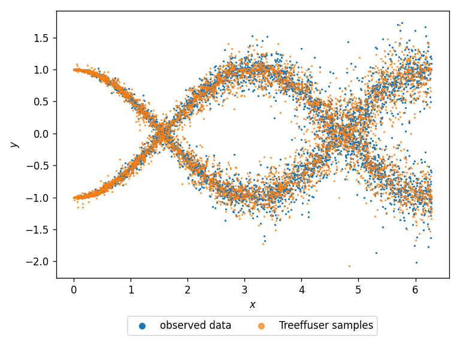

# Treeffuser

Treeffuser is an easy-to-use package for **probabilistic prediction on tabular data with tree-based diffusion models**. Treeffuser estimates distributions of the form `p(y|x)` where `x` is a feature vector and `y` is a target vector. Treeffuser can model conditional distributions `p(y|x)` that are arbitrarily complex (e.g., multimodal, heteroscedastic, non-gaussian, heavy-tailed, etc.). It is designed to adhere closely to the scikit-learn API and requires minimal user tuning.

## Installation

You can install Treeffuser via pip from PyPI with the following command:

```bash
pip install treeffuser
```

You can also install the development version with:

```bash
pip install git+https://github.com/blei-lab/tree-diffuser.git@main
```

## Usage Example

Here's a simple example demonstrating how to use Treeffuser. 

We generate an heteroscedastic response with two sinusoidal components and heavy tails.

```python
import matplotlib.pyplot as plt
import numpy as np
from treeffuser import Treeffuser

# Generate data
seed = 0
rng = np.random.default_rng(seed=seed)
n = 5000
x = rng.uniform(0, 2 * np.pi, size=n)
z = rng.integers(0, 2, size=n)
y = z * np.sin(x - np.pi / 2) + (1 - z) * np.cos(x) + rng.laplace(scale=x / 30, size=n)
```

We fit Treeffuser and generate samples. We then plot the samples against the raw data.

```python
# Fit the model
model = Treeffuser(seed=seed)
model.fit(x, y)

# Generate and plot samples
y_samples = model.sample(x, n_samples=1, seed=seed, verbose=True)
plt.scatter(x, y, s=1, label="raw data")
plt.scatter(x, y_samples[0, :], s=1, alpha=0.7, label="samples")
```



Treeffuser accurately learns the target conditional densities and can generate samples from them. 

Then, the Treeffuser samples can be used to compute any downstream estimates of interest.

```python
y_samples = model.sample(x, n_samples=100, verbose=True)

# Estimate downstream quantities of interest
y_mean = y_samples.mean(axis=0)
y_std = y_samples.std(axis=0)
y_q05, y_q95 = np.quantile(y_samples, q=[0.05, 0.95], axis=0)
```

Please take a look at the documentation for more information on the available methods and parameters.
